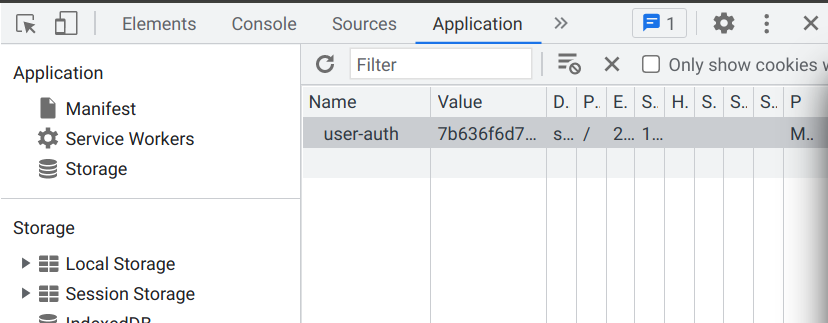
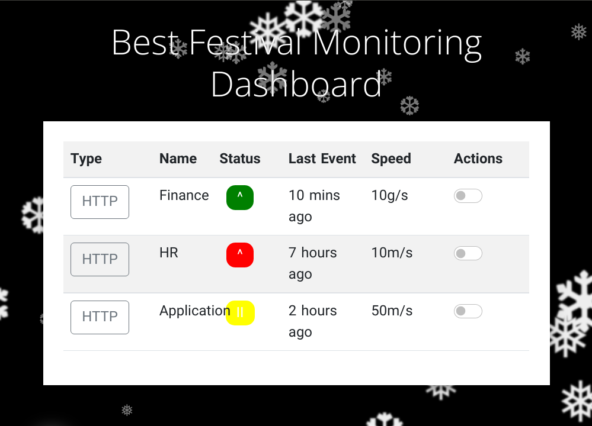

# `[Web Exploitation]` Elf HR Problems
## Story

> McSkidy needs to check if any other employee elves have left/been affected by Grinch Industries attack, but the systems that hold the employee information have been hacked. Can you hack them back to determine if the other teams in the Best Festival Company have been affected?

>*Register an account, and verify the cookies using the Developer Tools in your browser.*

>We were provided with a link to a logon page

### What is the name of the new cookie that was created for your account? `*********`

Opening developer options once creating an account allowed me to easily see the cookie.



`user-auth`

### What encoding type was used for the cookie value? `***********`

`hexadecimal`

### What object format is the data of the cookie stored in? `****`

`json`

>*Manipulate the cookie and bypass the login portal.*

### What is the value of the administrator cookie? (username = admin) `****...****`

I used [cyberchef](https://gchq.github.io/CyberChef) to copy the cookie into. Converted it to ASCII, then modified the username and converted it back to hex.

```
7b636f6d70616e793a2022546865204265737420466573746976616c20436f6d70616e79222c206973726567697374657265643a2254727565222c20757365726e616d653a2261646d696e227d
```

### What team environment is not responding? `**`

Going back to the homepage, I was now able to see the monitoring dashboard.  



`HR`

### What team environment has a network warning? `***********`

`Application`