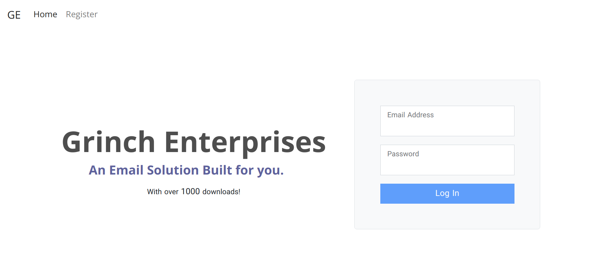
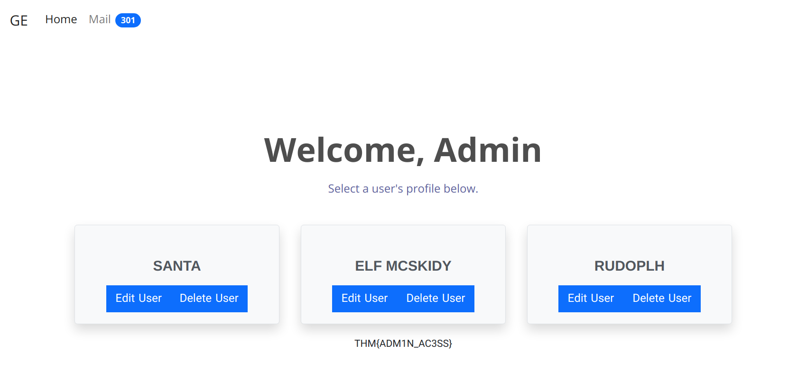

# `[Web Exploitation]` Christmas Blackout

## Story
>Grinch Enterprises have also tried to block communication between anyone at the company. They've locked everyone out of their email systems and McSysAdmin has also lost access to their admin panel. Can you find the admin panel and help restore communication for the Best Festival Company.

> We are provided with an IP to investigate.

### Using a common wordlist for discovering content, enumerate http://10.10.144.142 to find the location of the administrator dashboard. What is the name of the folder? `*****`

I ensured I was connected to the THM OpenVPN server

```
$ sudo openvpn martrewes.opvn
```
Once connected, I quickly tried to open the site in a web browser to ensure everything was connected properly



Now to enumerate using gobuster:

```
$ gobuster dir -u http://10.10.144.142 -w /usr/share/seclists/Discovery/Web-Content/common.txt -o gobuster.log 
```
which gave me the output of:

```
/.hta                 (Status: 403) [Size: 278]
/.htaccess            (Status: 403) [Size: 278]
/.htpasswd            (Status: 403) [Size: 278]
/admin                (Status: 301) [Size: 314] [--> http://10.10.144.142/admin/]
/assets               (Status: 301) [Size: 315] [--> http://10.10.144.142/assets/]
/index.html           (Status: 200) [Size: 5061]
/javascript           (Status: 301) [Size: 319] [--> http://10.10.144.142/javascript/]
/server-status        (Status: 403) [Size: 278]
```
<details>
  <summary>Answer:</summary>

```
admin
```
</details>

### In your web browser, try some default credentials on the newly discovered login form for the "administrator" user. What is the password? `*************`

Just tried a few defaults.

<details>
  <summary>Answer:</summary>

```
administrator
```
</details>

### Access the admin panel. What is the value of the flag? `***{***********}`

The flag was at the bottom of the panel page.



<details>
  <summary>Answer:</summary>

```
THM{ADM1N_AC3SS}
```
</details>