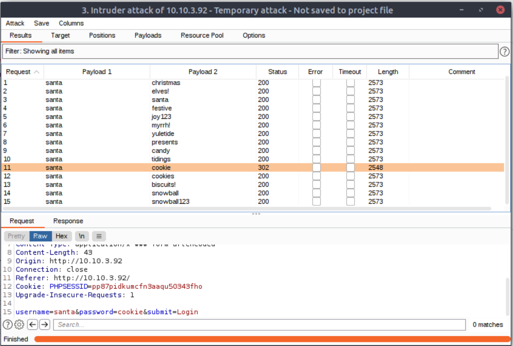

# `[Web Exploitation]` Santa's Running Behind

## Story

>McSysAdmin managed to reset everyone's access except Santa's! Santa's expected some urgent travel itinerary for his route over Christmas. Rumour has it that Santa never followed the password security recommendations. Can you use bruteforcing to help him access his accounts?

>Access the login form at http://10.10.3.92

>Configure Burp Suite & Firefox, submit some dummy credentials and intercept the request. Use intruder to attack the login form.

### What valid password can you use to access the "santa" account? `******`

I decided to use the AttackBox provided by THM for this one.

It was a bit of a pain though seeing up the payload, as a cluster bomb attack required at least 2 payload sets. For this I just highlighted the username and made sure it just used `santa`, then used the password list. It was easy to tell which password was correct because the Status and Length was identical on all but one.

`cookies`

### What is the flag in Santa's itinerary? `***{**************}`

I used this information to log into the site. Flag was at the bottom.

`THM{SANTA_DELIVERS}`
