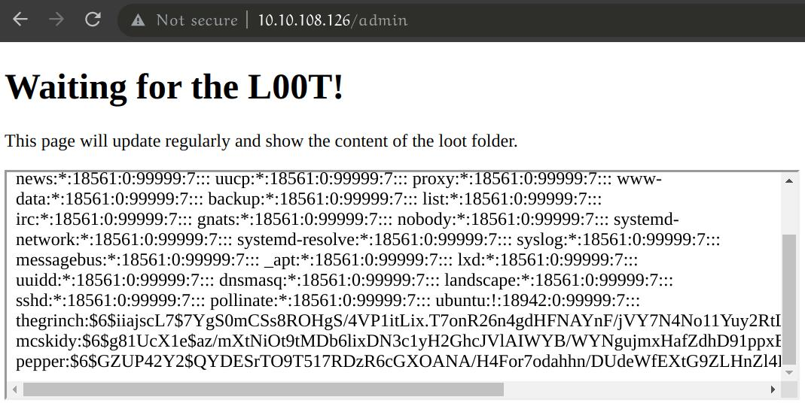
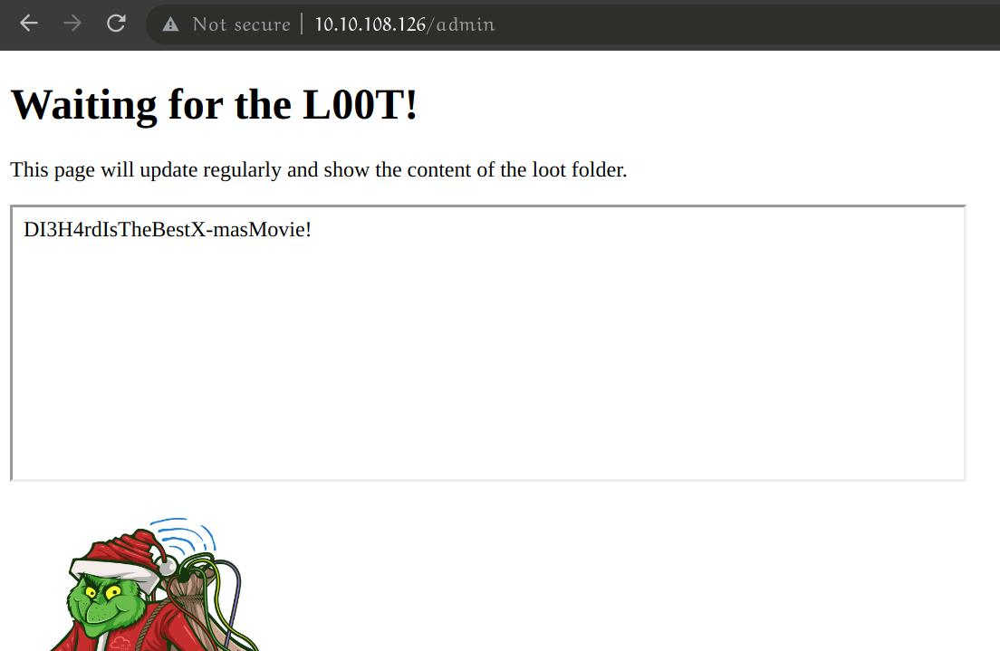

# `[Networking]` Dev(Insecure)Ops

## Story
>McDev - the head of the dev team, sends an alarming email stating that they're unable to update the best festival company's external web application. Without this update, no one can view the Best Festival Company's plan. The dev team has been using a CI/CD server to automatically push out updates to the server but the CI/CD server has been compromised. Can you help them get their server back?

### How many pages did the dirb scan find with its default wordlist? `*`

I ran `gobuster` on the ip address

```
$ gobuster dir -u http://10.10.108.126 -w /usr/share/seclists/Discovery/Web-Content/common.txt -o gobuster.log
===============================================================
Gobuster v3.1.0
by OJ Reeves (@TheColonial) & Christian Mehlmauer (@firefart)
===============================================================
[+] Url:                     http://10.10.108.126
[+] Method:                  GET
[+] Threads:                 10
[+] Wordlist:                /usr/share/seclists/Discovery/Web-Content/common.txt
[+] Negative Status codes:   404
[+] User Agent:              gobuster/3.1.0
[+] Timeout:                 10s
===============================================================
2021/12/14 15:46:16 Starting gobuster in directory enumeration mode
===============================================================
/.hta                 (Status: 403) [Size: 278]
/.htpasswd            (Status: 403) [Size: 278]
/.htaccess            (Status: 403) [Size: 278]
/admin                (Status: 200) [Size: 363]
/index.html           (Status: 200) [Size: 169]
/server-status        (Status: 403) [Size: 278]
/warez                (Status: 200) [Size: 606]
                                               
===============================================================
2021/12/14 15:46:53 Finished
===============================================================

```

<details>
  <summary>Answer:</summary>

```
4
```
</details>

### How many scripts do you see in the /home/thegrinch/scripts folder? `*`

Logged into the server using `ssh` with the credentials provided by the page (`mcskidy:Password1`). The I navigartted to the correct folder.

```
mcskidy@ip-10-10-108-126:~$ cd /home/thegrinch/scripts
mcskidy@ip-10-10-108-126:/home/thegrinch/scripts$ ls
check.sh  cleanup.sh  loot.sh  test.sh
```

<details>
  <summary>Answer:</summary>

```
4
```
</details>

### What are the five characters following $6$G in pepper's password hash? `*****`

I had to change the loot.sh script to cat out `/etc/shadow`. Then navigated to http://10.10.108.126/admin.



<details>
  <summary>Answer:</summary>

```
ZUP42
```
</details>

### What is the content of the flag.txt file on the Grinch's user’s desktop? `***************************`

First I changed the `loot.sh` script to display `check.sh` on the admin page. Looking at this, I was able to deduce that I need to create a file called `remindme.txt` in the loot folder. This will allow me to see the password using http://10.10.108.126/pass.

This same process can be used to display the contents of `flag.txt`



<details>
  <summary>Answer:</summary>

```
DI3H4rdIsTheBestX-masMovie!
```
</details>